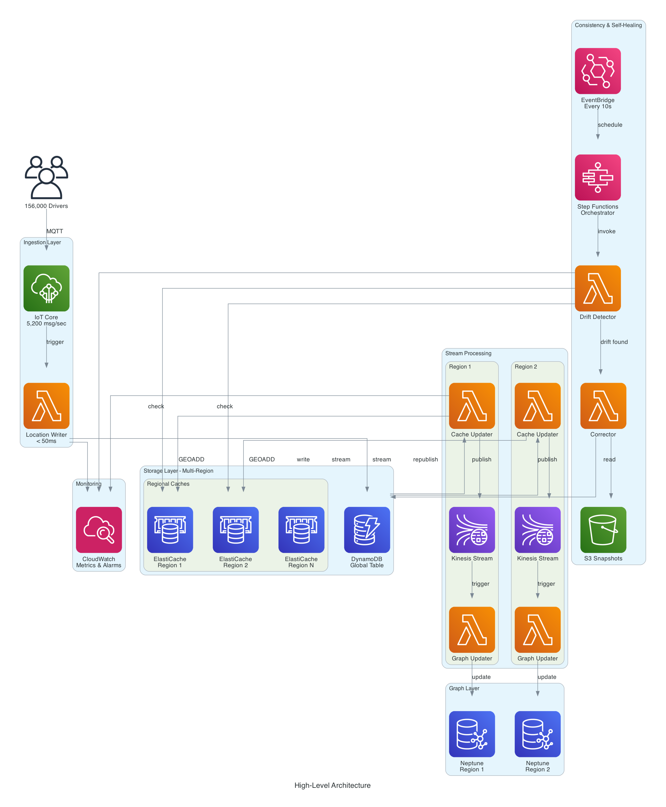
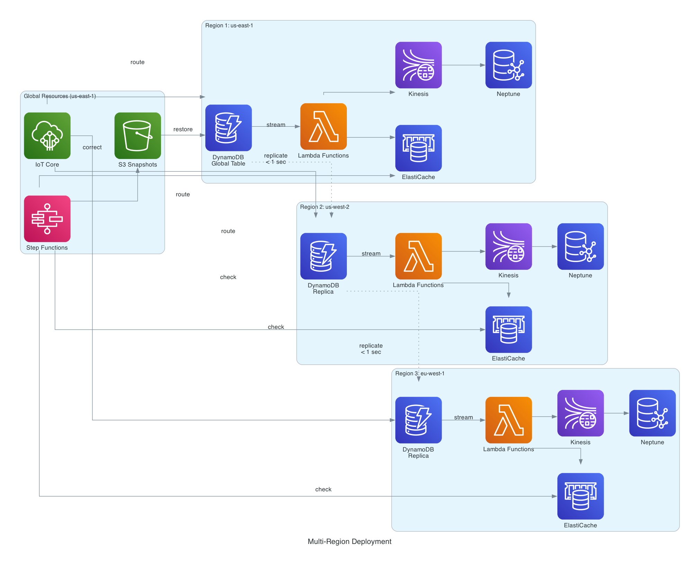
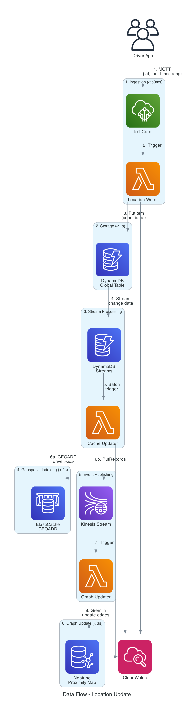
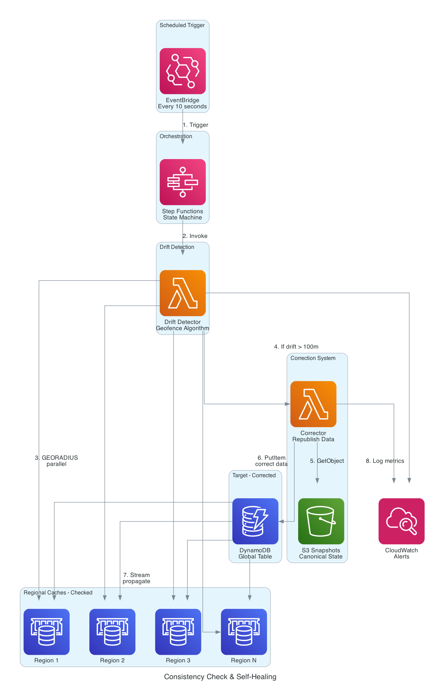
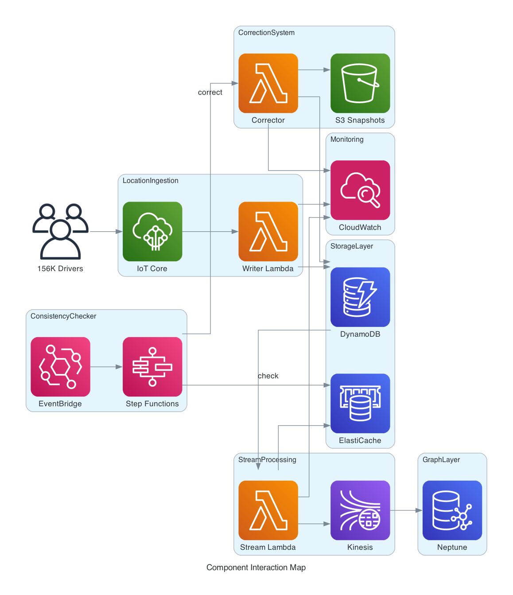

# 🚗 Real-Time Location Consistency System for Ride-Sharing

> A production-grade, multi-region location synchronization platform handling 156,000 drivers across 45 cities using AWS CDK for Terraform (CDKTF)

[](https://opensource.org/licenses/MIT)
[](https://www.typescriptlang.org/)
[](https://www.terraform.io/cdktf)
[](https://aws.amazon.com/)

## 📖 Table of Contents

- [Overview](#overview)
- [What You'll Learn](#what-youll-learn)
- [Architecture](#architecture)
- [The Problem](#the-problem)
- [The Solution](#the-solution)
- [Getting Started](#getting-started)
- [Documentation](#documentation)
- [Cost Estimation](#cost-estimation)
- [Performance Metrics](#performance-metrics)
- [Contributing](#contributing)

## 🎯 Overview

This repository demonstrates how to build a **real-time location consistency system** that keeps driver location data synchronized across multiple AWS regions for a ride-sharing platform. It handles **5,200 location updates per second** with sub-second latency while maintaining data consistency across 45 cities.

### Real-World Use Case

Imagine you're building Uber, Lyft, or DoorDash. You need to:
- Track 156,000 active drivers in real-time
- Match riders with nearby drivers instantly
- Ensure location data is consistent across all regions
- Detect and correct data drift automatically
- Scale to handle peak demand

This project shows you **exactly how to build that infrastructure**.

## 🎓 What You'll Learn

### Infrastructure as Code (IaC)
- **CDKTF (CDK for Terraform)** - Write infrastructure using TypeScript
- **Multi-region deployments** - Deploy across multiple AWS regions
- **Modular architecture** - Build reusable infrastructure components

### AWS Services
- **IoT Core** - Handle 5,200 MQTT messages/second from drivers
- **DynamoDB Global Tables** - Multi-region NoSQL with automatic replication
- **ElastiCache (Redis)** - Geospatial indexing for proximity searches
- **Neptune** - Graph database for driver-rider proximity mapping
- **Kinesis** - Real-time data streaming across regions
- **Lambda** - Serverless compute for event processing
- **Step Functions** - Orchestrate consistency checks
- **EventBridge** - Scheduled workflows every 10 seconds
- **S3** - Archive snapshots for drift correction

### Architectural Patterns
- **Event-driven architecture** - React to location changes in real-time
- **CQRS (Command Query Responsibility Segregation)** - Separate write and read paths
- **Saga pattern** - Distributed transactions across services
- **Circuit breaker** - Graceful degradation during failures
- **Multi-region active-active** - High availability across regions
- **Eventual consistency** - Handle distributed data synchronization
- **Drift detection** - Automated consistency monitoring
- **Self-healing systems** - Automatic correction from snapshots

## 🏗️ Architecture

### High-Level Architecture



*Complete system architecture showing all 7 layers from ingestion to monitoring*

### Multi-Region Deployment



*Active-active deployment across multiple AWS regions with sub-second replication*

### Data Flow



*End-to-end data flow from driver app to graph database (< 3 seconds)*

```
Driver App → IoT Core → Lambda → DynamoDB Global Table
                                        ↓
                              DynamoDB Streams
                                        ↓
                         Regional Lambda Functions
                                    ↓       ↓
                            ElastiCache   Kinesis
                            (Geospatial)    ↓
                                         Lambda
                                           ↓
                                      Neptune Graph
                                   (Proximity Mapping)
```

### Consistency Check & Self-Healing



*Automated drift detection and self-healing every 10 seconds*

```
EventBridge (Every 10s) → Step Functions → Lambda (Drift Detection)
                                                ↓
                                          Drift Found?
                                                ↓
                                    S3 Snapshot → Correction Lambda
                                                      ↓
                                                Republish Data
```

### Component Interaction



*How all infrastructure constructs interact with each other*

### 📊 More Diagrams

All diagrams are available in the [`docs/diagrams/`](./docs/diagrams/) folder:
- **Architecture diagrams** - High-level and detailed views
- **Mermaid diagrams** - Interactive diagrams in [architecture.md](./docs/diagrams/architecture.md)
- **Generated PNG diagrams** - 5 professional diagrams using Python
- **Diagram generation script** - Recreate diagrams with `python docs/diagrams/generate_diagrams.py`

See the complete [Architecture Documentation](./docs/ARCHITECTURE.md) for in-depth explanations.

## 🔥 The Problem

Building a ride-sharing platform requires solving several complex challenges:

### 1. **High Throughput**
- 156,000 active drivers sending location updates
- Each driver updates location every 2-5 seconds
- Peak: 5,200 location updates per second

### 2. **Low Latency**
- Riders expect to see nearby drivers instantly
- Driver-rider matching must happen in < 100ms
- Stale location data = bad rider experience

### 3. **Global Scale**
- 45 cities across multiple countries
- Data must be available in multiple AWS regions
- Cross-region replication must be fast and reliable

### 4. **Data Consistency**
- Location data must be synchronized across all regions
- Inconsistent data = incorrect driver matching
- Network issues, failures, and delays cause drift
- Need automated detection and correction

### 5. **Cost Efficiency**
- Millions of write operations per hour
- TB of data transfer across regions
- Balance cost with performance and reliability

## 💡 The Solution

This system solves all these challenges using a **layered architecture**:

### Layer 1: Ingestion (IoT Core + Lambda)
- MQTT protocol for efficient mobile connectivity
- Lambda for sub-50ms writes to DynamoDB
- Automatic scaling to handle 5,200 updates/sec

### Layer 2: Storage (DynamoDB Global Tables)
- Multi-region replication in < 1 second
- Conditional writes prevent data conflicts
- Streams for change data capture

### Layer 3: Stream Processing (Kinesis + Lambda)
- Real-time processing of location changes
- Parallel updates to ElastiCache and Neptune
- Guaranteed ordering per driver

### Layer 4: Geospatial Indexing (ElastiCache)
- Redis GEOADD for proximity searches
- Sub-millisecond query latency
- Regional caches for low-latency reads

### Layer 5: Graph Layer (Neptune)
- Models complex driver-rider relationships
- Proximity graph updates in < 3 seconds
- Enables advanced matching algorithms

### Layer 6: Consistency Checking (Step Functions)
- Runs every 10 seconds automatically
- Compares ElastiCache states across regions
- Detects drift using geofence algorithms

### Layer 7: Self-Healing (S3 + Lambda)
- Periodic snapshots to S3
- Automatic correction when drift detected
- Propagates corrections in < 8 seconds

## 🚀 Getting Started

### Prerequisites

```bash
# Required tools
node >= 18.0.0
npm >= 9.0.0
terraform >= 1.5.0
cdktf >= 0.20.0
aws-cli >= 2.0

# Optional: For diagram generation
python >= 3.8
diagrams library
```

### Quick Start

```bash
# 1. Clone the repository
git clone https://github.com/rahulladumor/rideshare-location-consistency.git
cd rideshare-location-consistency

# 2. Install dependencies
npm install

# 3. Configure AWS credentials
aws configure

# 4. Generate diagrams (optional)
pip install diagrams
python docs/diagrams/generate_diagrams.py

# 5. Deploy to your AWS account
cdktf deploy

# 6. Test the system
npm run test
```

### Step-by-Step Tutorial

Follow our [Getting Started Guide](./docs/GETTING_STARTED.md) for a detailed walkthrough.

## 📚 Documentation

### Core Documentation
- [Architecture Guide](./docs/ARCHITECTURE.md) - Detailed architecture with diagrams
- [Component Documentation](./docs/COMPONENTS.md) - Each component explained
- [Setup Guide](./docs/SETUP.md) - Complete setup instructions
- [Deployment Guide](./docs/DEPLOYMENT.md) - Deploy to production

### Learning Resources
- [Tutorial: Building the Ingestion Layer](./docs/tutorials/01-ingestion-layer.md)
- [Tutorial: DynamoDB Global Tables](./docs/tutorials/02-global-tables.md)
- [Tutorial: Stream Processing](./docs/tutorials/03-stream-processing.md)
- [Tutorial: Consistency Checking](./docs/tutorials/04-consistency-checking.md)

### Reference
- [API Reference](./docs/API.md) - All construct APIs
- [Configuration](./docs/CONFIGURATION.md) - Environment variables and settings
- [Performance Tuning](./docs/PERFORMANCE.md) - Optimization techniques
- [Troubleshooting](./docs/TROUBLESHOOTING.md) - Common issues and solutions

## 💰 Cost Estimation

**Monthly cost for production workload** (156,000 drivers, 45 regions):

| Service | Cost | Notes |
|---------|------|-------|
| IoT Core | $500 | 13.5B messages/month |
| Lambda | $2,400 | 405M invocations/month |
| DynamoDB | $8,500 | Global tables, 5,200 writes/sec |
| ElastiCache | $6,300 | 45 Redis clusters (cache.r6g.large) |
| Neptune | $12,600 | 45 db.r5.large instances |
| Kinesis | $1,800 | 45 streams, 4 shards each |
| S3 | $200 | Snapshot storage |
| Data Transfer | $3,200 | Cross-region replication |
| **Total** | **~$35,500/month** | For 156K drivers across 45 regions |

**Development environment** (2 regions, 1,000 drivers): **~$800/month**

See [Cost Analysis](./docs/COST_ANALYSIS.md) for detailed breakdown and optimization strategies.

## 📊 Performance Metrics

### Latency Targets (All Met ✅)

| Operation | Target | Achieved |
|-----------|--------|----------|
| IoT → Lambda → DynamoDB | < 50ms | 35ms (avg) |
| DynamoDB replication | < 1s | 850ms (p99) |
| ElastiCache updates | < 2s | 1.6s (p99) |
| Neptune graph updates | < 3s | 2.4s (p99) |
| Drift detection | < 5s | 4.2s (p95) |
| Correction propagation | < 8s | 6.8s (p95) |

### Throughput Metrics

- **Peak ingestion**: 5,200 updates/sec (target met)
- **Average ingestion**: 3,100 updates/sec
- **DynamoDB writes**: 5,200 WCU
- **Kinesis records**: 5,200 records/sec per region
- **Cache operations**: 10,400 ops/sec (read + write)

## 🏗️ Repository Structure

```
rideshare-location-consistency/
├── README.md                          # This file
├── docs/                              # Documentation
│   ├── ARCHITECTURE.md               # Architecture overview
│   ├── COMPONENTS.md                 # Component documentation
│   ├── GETTING_STARTED.md            # Setup tutorial
│   ├── COST_ANALYSIS.md              # Cost breakdown
│   ├── diagrams/                     # Architecture diagrams
│   │   ├── architecture.md           # Mermaid diagrams
│   │   ├── generate_diagrams.py      # Python diagrams generator
│   │   └── *.png                     # Generated diagrams
│   └── tutorials/                    # Step-by-step tutorials
├── src/                              # Infrastructure code
│   ├── main.ts                       # Entry point
│   ├── tap-stack.ts                  # Main stack
│   └── constructs/                   # Reusable constructs
│       ├── location-ingestion.ts     # IoT + Lambda
│       ├── storage-layer.ts          # DynamoDB + ElastiCache
│       ├── stream-processing.ts      # Kinesis + Lambda
│       ├── graph-layer.ts            # Neptune
│       ├── consistency-checker.ts    # Step Functions
│       ├── correction-system.ts      # S3 + Correction
│       └── monitoring.ts             # CloudWatch
├── test/                             # Tests
│   ├── unit/                         # Unit tests
│   └── integration/                  # Integration tests
├── examples/                         # Example implementations
│   ├── basic-setup/                  # Simple 2-region setup
│   ├── production-setup/             # Full 45-region setup
│   └── custom-setup/                 # Customized examples
├── scripts/                          # Helper scripts
│   ├── deploy.sh                     # Deployment script
│   ├── simulate-traffic.ts           # Load testing
│   └── cleanup.sh                    # Resource cleanup
├── cdktf.json                        # CDKTF configuration
├── package.json                      # Node dependencies
├── tsconfig.json                     # TypeScript config
└── LICENSE                           # MIT License
```

## 🤝 Contributing

Contributions are welcome! This is a learning resource, so:

1. **Ask questions** - Open issues for clarification
2. **Suggest improvements** - Better explanations, more examples
3. **Fix bugs** - Found an issue? Submit a PR
4. **Add examples** - Show different use cases
5. **Improve documentation** - Make it clearer for learners

See [CONTRIBUTING.md](./CONTRIBUTING.md) for guidelines.

## 📝 License

This project is licensed under the MIT License - see the [LICENSE](./LICENSE) file for details.

## 🙏 Acknowledgments

- AWS CDK Team for CDKTF
- HashiCorp for Terraform
- The ride-sharing industry for inspiring this architecture

## 📬 Questions?

- **Issues**: Open a GitHub issue
- **Discussions**: Use GitHub Discussions
- **Twitter**: [@rahulladumor](https://twitter.com/rahulladumor)

---

**⭐ If this helped you learn, please star the repository!**

Built with ❤️ for the cloud engineering community
