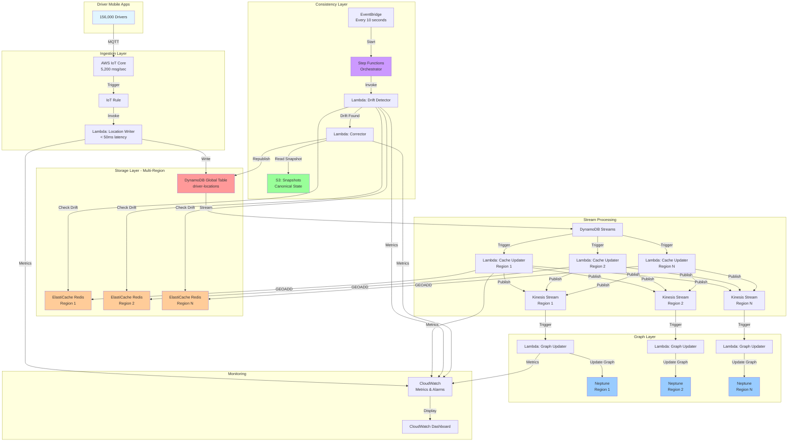
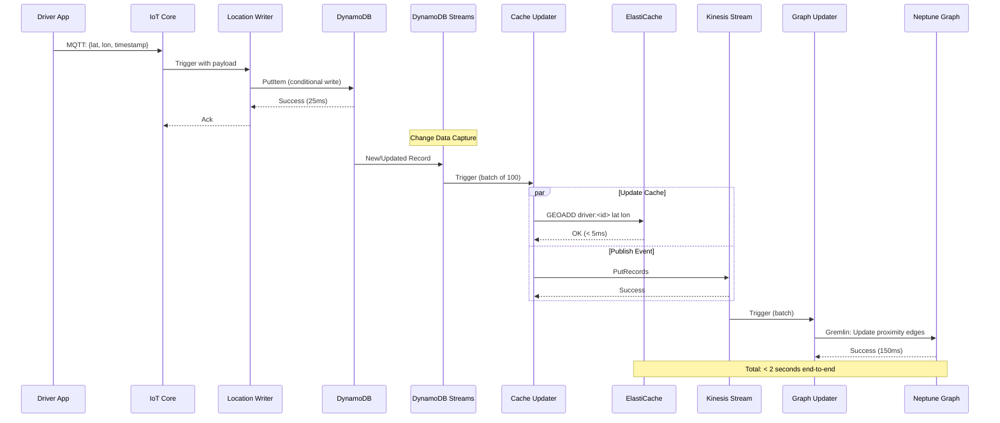
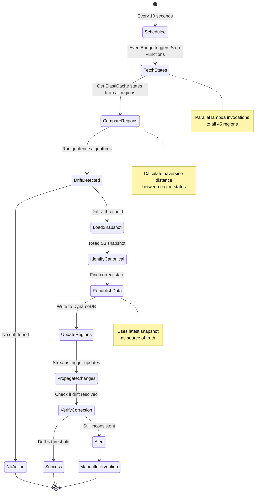
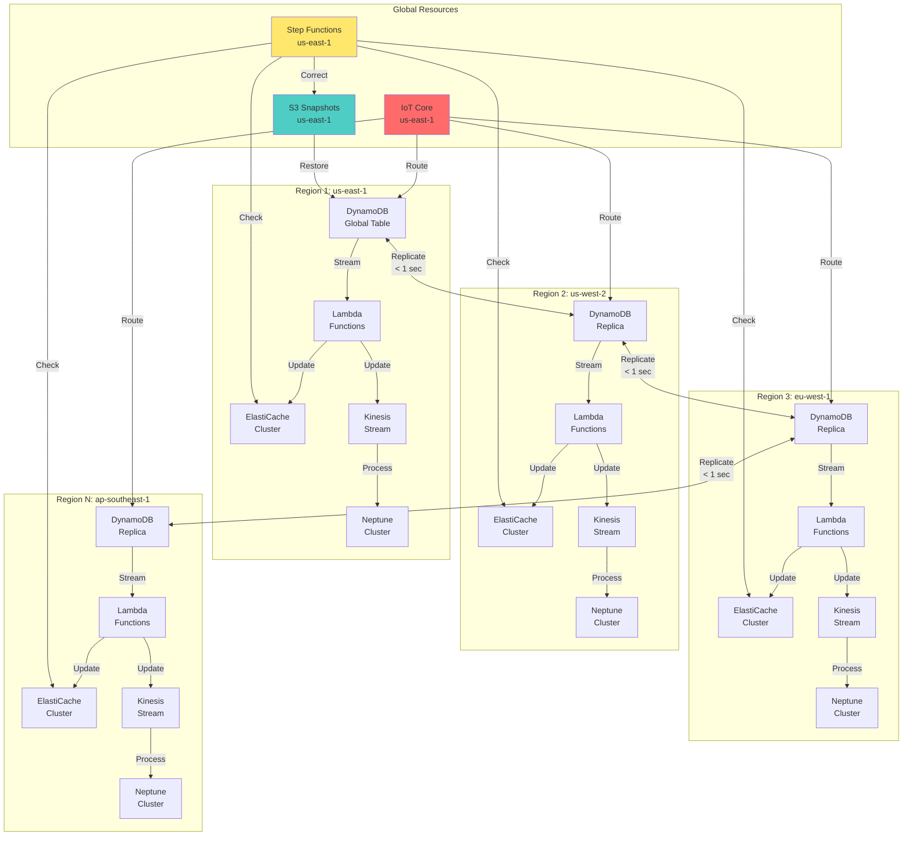
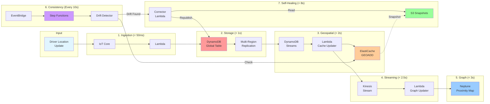
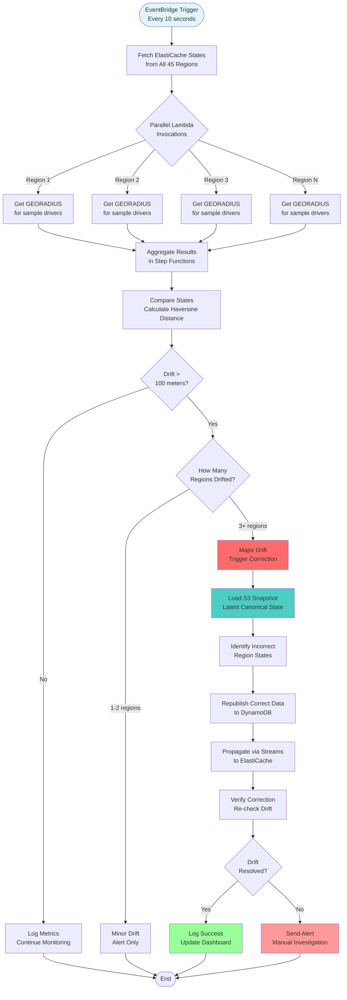
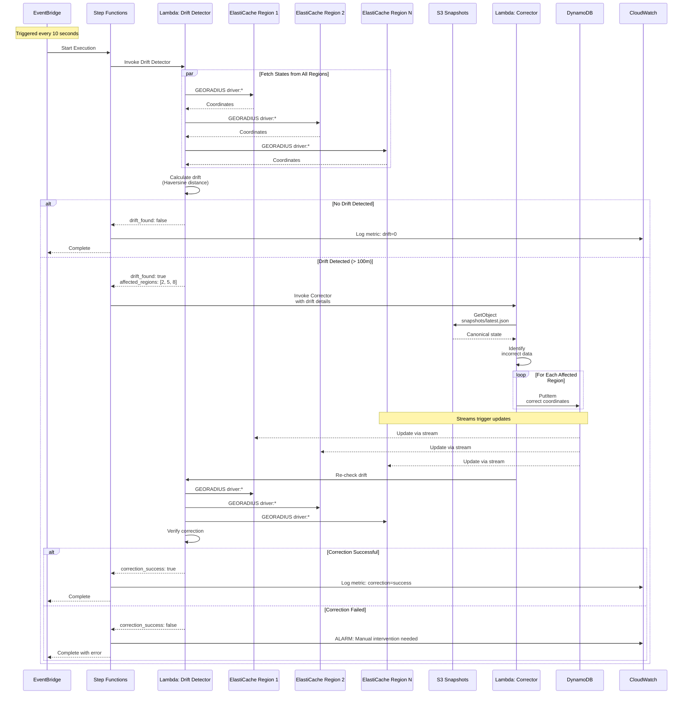
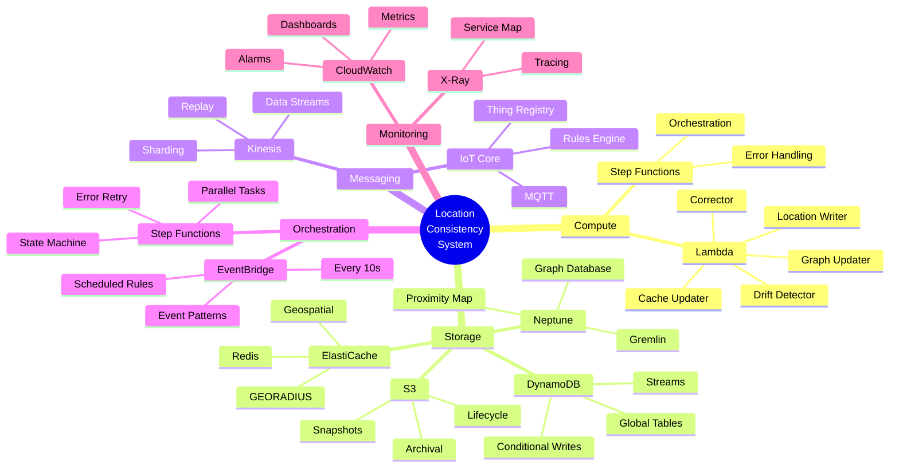
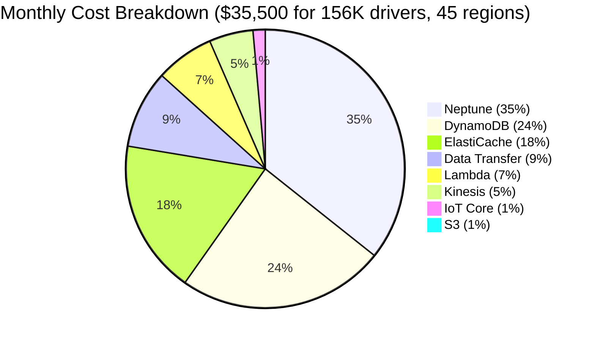

# Architecture Diagrams

This document contains all architecture diagrams in Mermaid format. These diagrams are rendered automatically on GitHub.

## Table of Contents

1. [High-Level System Architecture](#high-level-system-architecture)
2. [Data Flow Diagram](#data-flow-diagram)
3. [Consistency Check Workflow](#consistency-check-workflow)
4. [Multi-Region Deployment](#multi-region-deployment)
5. [Component Interaction](#component-interaction)
6. [Drift Detection Flow](#drift-detection-flow)
7. [Self-Healing Process](#self-healing-process)

---

## High-Level System Architecture

---

## Data Flow Diagram

---

## Consistency Check Workflow

---

## Multi-Region Deployment

---

## Component Interaction

---

## Drift Detection Flow

---

## Self-Healing Process

---

## AWS Services Integration

---

## Performance Breakdown

```mermaid
gantt
    title End-to-End Latency Breakdown (Per Location Update)
    dateFormat SSS
    axisFormat %L ms
    
    section Ingestion
    IoT Core receive           :a1, 000, 5ms
    IoT Rule trigger          :a2, after a1, 3ms
    Lambda cold start (worst) :a3, after a2, 500ms
    Lambda processing         :a4, after a2, 15ms
    DynamoDB write           :a5, after a4, 20ms
    
    section Replication
    DynamoDB replication     :b1, after a5, 850ms
    
    section Cache Update
    Stream trigger           :c1, after b1, 50ms
    Lambda process batch     :c2, after c1, 100ms
    ElastiCache GEOADD       :c3, after c2, 5ms
    
    section Stream Publishing
    Kinesis PutRecords       :d1, after c2, 50ms
    
    section Graph Update
    Kinesis trigger          :e1, after d1, 100ms
    Lambda graph processor   :e2, after e1, 150ms
    Neptune update           :e3, after e2, 200ms
    
    section Target Lines
    50ms target :milestone, 050, 0ms
    1s replication target :milestone, 1000, 0ms
    2s cache target :milestone, 2000, 0ms
    3s graph target :milestone, 3000, 0ms
```

---

## Cost Distribution

---

These diagrams are embedded in the documentation and render automatically on GitHub. You can also generate PNG versions using the Python diagrams library (see `generate_diagrams.py`).
